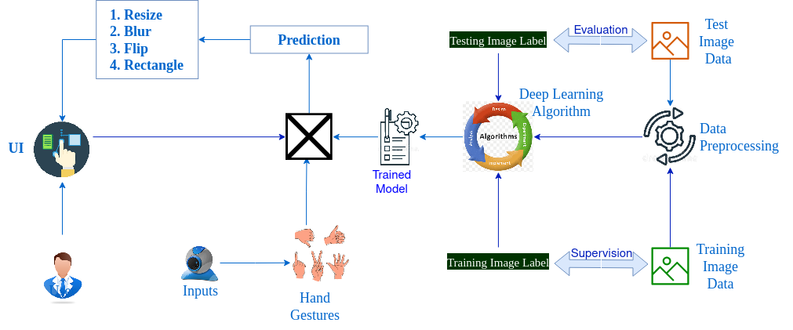

# A Gesture-based Tool for Sterile Browsing of Radiology Images

This project aims to build a hands-free digital image browsing system for use in a sterile setting in a medical environment.

> This project was evaluated on an incremental basis at multiple stages by an **Academic Mentor** from [SSN College of Engineering, Chennai, India](https://www.ssn.edu.in/college-of-engineering/computer-science-and-engineering-department-ssn-institutions/), and an **Industry Mentor** from [IBM](https://careereducation.smartinternz.com/), as part of an Innovation, Employability and Entrepreneurship program for students.

## Quick Links

- [Project Repository](https://github.com/IBM-EPBL/IBM-Project-21974-1659800381)
- [Project Demonstration Video](https://drive.google.com/file/d/1ZVg7bqdMY6afFfRHukROtoy74wmqAJZp/view?usp=share_link)
- [Project Report](./Final-Deliverables/Project-Report_PNT2022TMID53060.pdf)

## Project Description

### Technology Applied

- Artificial Intelligence
- Deep Learning
- Image Processing
- Web Development
- Cloud Database

### Motivation

Surgeons and doctors often require reference imaging results whilst operating on patients. Furthermore, they may need to manipulate the image view through basic tranformative operations such as panning, scaling, and rotation among others. However, in doing so, computer peripheral devices need to be accessed through touch. To avoid compromising the sterility of their instruments and operating hand, they presently instruct surgical assistants to operate the viewing media to adjust it to their requirement. The granularity in reaching their required state of view is limited to the effectiveness of the verbal communication, and can often take several attempts before reaching the required state. 

### Proposed Solution

To eliminate the need for such an assistant, and to make the manipulation operations more granular and completely in control of the surgeon/doctor, our system proposes to use gestures as the instruction media. The getures are captured through a camera attached to the viewing system; the digital frames are processed to recognize the gesture using deep learning; each gesture is mapped to a corresponding transformations on the image; and the transformation is effected on the image. This makes for a hands-free sterility-preserving view manipulation mechanism.

### Implemented System

In practicality, the system's machine learning backend may be trained to recognize any number of gestures. For this proof-of-concept project, we implement 6 different gestures, and map them to specific operations on a medical image. The entire system is deployed on a web-server, with user-management, real-time gesture capturing, recognition and change effecting using peripherals commonly found on a typical personal computer: web-camera, LCD display and trackpad/mouse. 

### Gesture-Action Mapping

The following operations are mapped to each gesture in the proof-of-concept implementation,

| Gesture Image   | Gesture Name | Action |
| :-----------: | :-----------: | :------: |
|  | Zero | Annotate the image with a rectangle | 
|  | One | Resize the image to resolution (200, 200) |
|  | Two | Rotate the image | 
|  | Three  | Blur the image |
|  | Four | Resize the image to resolution (400, 400) |
|  | Five  | Convert the image to grayscale |

### Technology Stack

- Tensforflow/Keras
- OpenCV
- NumPy
- Flask
- NodeRED

## Team

- **Team ID:** PNT2022TMID53060
- **Project ID:** IBM-Project-21974-1659800381

| Role     | Name | Register Number |
| :-----------: | :-----------: | :------: |
| Team Leader | [Karthik D](https://github.com/karthik-d) | 195001047 | 
| Team Member 1 | [A Anirudh](https://github.com/AAnirudh07) | 195001015 |
| Team Member 2 | [Nestor Ingarshal J](https://github.com/Ingarshal29-7) | 195001069 | 
| Team Member 3 | [Pugalarasu K](https://github.com/Pugal77) | 195001306 |

## Mentors and Evaluators

This project was evaluated on an incremental basis at multiple stages by **Academic Experts** from [SSN College of Engineering, Chennai, India](https://www.ssn.edu.in/college-of-engineering/computer-science-and-engineering-department-ssn-institutions/), and an **Industry Experts** from [IBM](https://careereducation.smartinternz.com/), as part of an Innovation, Employability and Entrepreneurship program for students.

| Role | Name |
| :-----------: | :------: |
| Academic Mentor | [Dr. Lakshmi Priya S](https://www.ssn.edu.in/staff-members/s-lakshmi-priya/) |
| Academic Evaluator | [Dr. Kanchana R](https://www.ssn.edu.in/staff-members/dr-r-kanchana/) |
| Industry Mentor and Evaluator | Ms. Pradeepthi |
